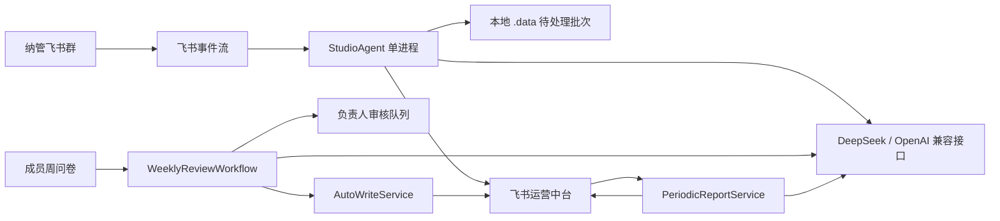

# CloudAgent 全方位逻辑与运行审计

## 执行结论

| 项目 | 结论 |
| --- | --- |
| 审计深度 | 标准深度，关键 AI/写入链路按高风险路径回溯 |
| 审计日期 | 2026-08-09 |
| 当前成熟度 | 内部测试 |
| 综合得分 | 41/100，未知证据权重约 18% |
| 置信度 | 中 |
| 上线建议 | 有条件：只读监听和草稿整理可继续受控使用；自动正式写入、人工审核执行和周期报告暂不应视为可上线能力 |
| P0 / P1 / P2 / P3 | 0 / 8 / 4 / 1 |

当前最大的事实不是“测试是否通过”，而是 Agent 已被线上健康监控判定为离线：进程仍存在，但心跳超过 10 分钟未更新。本次审计同时用 6 个负向逻辑探针复现了审核、写入、人工决策和报告链路中的真实缺陷。

本报告是基于仓库与当前可访问运行证据的工程审计，不是认证、渗透测试、法律意见，也不保证不存在其他缺陷。

## 前五项风险

| ID | 严重度 | 风险 | 证据 | 发布影响 |
| --- | --- | --- | --- | --- |
| CA-001 | P1 | Agent 进程存活但事件循环失去心跳，当前已被判定离线 | 线上运行状态、14 个本地批次、同步 CLI 路径 | 阻断实时可靠性声明 |
| CA-008 | P1 | Agent 使用的用户身份权限远超实际需要 | `npm run doctor` 脱敏结果、`src/review-base-gateway.js:65` | 阻断广权限自动化上线 |
| CA-002 | P1 | 自动写入与周期报告配置开关不生效 | `config/agent.config.json:225`、`src/review-workflow.js:204` | 阻断自动正式写入 |
| CA-004 | P1 | 人工审核状态机不能完整执行，暂缓事项会被错误终结 | `src/review-workflow.js:237`、负向探针 | 阻断审核闭环 |
| CA-006 | P1 | 周报月报没有独立二审，且会混入其他周期审核事项 | `src/periodic-reports.js:84`、负向探针 | 阻断周期报告正式使用 |

## 前五项投入

| 优先级 | 能力 | 原因 | 验收信号 |
| --- | --- | --- | --- |
| 1 | 运行时隔离与异步飞书网关 | 当前真实离线 | 心跳连续 24 小时按期更新，压力期间事件无丢失 |
| 2 | 强制执行功能开关 | 自动写入缺少有效总闸 | 关闭后所有正式写入负向测试为 0 次 |
| 3 | 审核状态机重建 | 多个表单状态无法闭环 | 每个状态都有转移表、执行结果和幂等测试 |
| 4 | 证据模型和报告二审 | 当前会把自述升为 A 并跨周期串数据 | 自报材料不得单独达到 A/B；报告来源严格按周期关联 |
| 5 | 最小权限应用身份 | 当前令牌爆炸半径过大 | 独立服务身份只保留所需表读写、消息读取和负责人私聊权限 |

## 范围与限制

- 纳入：v0.7 问卷、双层 AI 审核、负责人队列、自动写入、回滚、周期报告、飞书网关、配置、迁移、测试、运行状态、权限和本地队列。
- 结构检查：原有群消息分析、路由、事件恢复、健康监控、Supervisor 和历史补读。
- 排除：图片、展位渲染、AI 导购文档、生成文件正文和个人聊天正文。
- 外部证据：飞书认证、运行状态、群监听状态、运营中台表结构和 npm 漏洞库。
- 未验证：服务器部署、备份恢复演练、飞书角色权限实际隔离、DeepSeek 数据保留设置、真实周报首次调度、多人并发写入。
- 未使用 Git 状态或历史；本次未修改产品代码和飞书数据。

## 系统图

关键边界：

- 群聊、成员问卷和飞书表内容均为不可信输入。
- AI 输出由 Zod 做结构校验，但跨字段语义约束不足。
- 新审核链路通过独立的同步 CLI 网关写飞书，与实时监听运行在同一 Node.js 进程。
- 自动写入使用用户身份，不是最小权限的专用服务身份。
- 本地 `.data` 保存脱敏后的消息正文和运行队列，未见保留期执行器。

## 关键链路回溯

### 问卷到正式记录

`成员周成长记录` -> 成员/项目解析 -> 确定性检查 -> 第一层提取 -> 第二层复核 -> 写审核记录 -> 自动写入或负责人队列。

主要断点：失败后状态变成“处理失败”并退出来源扫描；自动写入开关没有被读取；证据等级可被成员自报链接直接提升。

### 负责人审核

负责人修改队列状态 -> 每 10 分钟轮询 -> 执行自动写入 -> 标记已执行。

主要断点：“调整项目”和“标记共同贡献”不会执行；“暂缓”和“要求补充”会被标记已执行，后续确认无法再次进入处理。

### 自动写入与回滚

创建操作日志 -> 写目标表 -> 回写日志成功状态；回滚时恢复旧快照或删除新记录。

主要断点：目标创建成功而日志收尾失败时可能重复创建；回滚不检查目标是否已被人工继续修改。

### 周报月报

读取周期问卷、审核记录和负责人队列 -> 生成成员/项目/工作室报告 -> AI 润色 -> 写入报告表。

主要断点：负责人队列没有周期关联过滤；报告没有独立审核状态机；AI 润色失败仍可写成报告，低风险报告直接标记“AI已审核”。

### 运行恢复

Supervisor -> Agent -> 四类事件消费者 -> 后台历史补读和维护 -> 心跳。

主要断点：同步 CLI 和同步等待仍与实时服务共用事件循环。当前进程存在但心跳已超时，被健康监控标记离线。

## 覆盖账本

| 模块/领域 | 深度 | 证据 | 缺口 |
| --- | --- | --- | --- |
| v0.7 审核、写入、报告模块 | 深入 | 全文件、行号、6 个负向探针 | 未连接生产模型做对抗测试 |
| 飞书 CLI 网关 | 深入 | 代码、分页探针、线上 EOF | 未做并发压测 |
| 原有 StudioAgent | 结构化 + 关键片段 | 84 项测试、启动和批次代码、线上状态 | 11 万字节单体未逐行复审 |
| 配置与迁移 | 深入 | 配置引用搜索、迁移代码、线上表结构 | 未做大于 200 条真实迁移演练 |
| 测试 | 深入 | 84 项测试、覆盖率报告 | 工作流和网关未进入覆盖报告 |
| 安全与隐私 | 深入 | 权限自检、脱敏代码、路径级扫描 | 第三方模型保留政策未验证 |
| CI/CD 与部署 | 结构化 | package scripts、文档搜索 | 无 CI、服务化部署和回滚证据 |
| 备份与恢复 | 结构化 | 单条写入回滚代码 | 无 Base 全量备份/恢复演练 |
| 前端 | N/A | 无前端产品 | 不适用 |

## 领域评分

前端 5 分权重因不适用被排除，其余权重归一化后总分约 41/100。

| 领域 | 原始权重 | 达成度 | 置信度 | P1 数 | 摘要 |
| --- | ---: | ---: | --- | ---: | --- |
| 产品与流程完整性 | 5 | 45% | 高 | 3 | 主流程存在，人工与报告闭环不完整 |
| 架构与边界 | 8 | 40% | 高 | 2 | 单进程、同步 CLI 和大单体形成高耦合 |
| 后端与接口 | 7 | 50% | 中 | 1 | 主网关较成熟，新网关缺分页和隔离 |
| 数据与一致性 | 8 | 35% | 高 | 4 | 幂等、周期关联、状态转移和回滚存在缺口 |
| 安全与隐私 | 12 | 35% | 中 | 2 | 有脱敏，但权限过宽且保留期未执行 |
| AI 保障 | 10 | 40% | 高 | 2 | 有双层提示和 schema，语义证据约束不足 |
| 测试与质量 | 10 | 55% | 高 | 0 | 84 项通过，但新状态机核心未加载覆盖 |
| CI/CD | 7 | 10% | 高 | 0 | 无 CI、发布门和自动安全检查 |
| 基础设施 | 7 | 20% | 中 | 1 | 本机 Supervisor，无服务级部署证据 |
| 可观测性与可靠性 | 8 | 40% | 高 | 1 | 健康监控能告警，但当前确实离线 |
| 性能与扩展性 | 5 | 25% | 高 | 2 | 同步阻塞、200 条截断、串行模型调用 |
| 文档与治理 | 5 | 45% | 高 | 0 | 方案详细，但 README 和实际版本漂移 |
| 连续性与合规 | 3 | 20% | 低 | 0 | 无恢复演练和第三方数据治理证据 |

## 就绪门

| 门槛 | 结果 | 证据 | 清除条件 |
| --- | --- | --- | --- |
| 当前核心旅程可稳定运行 | 未通过 | 线上状态已判定离线 | 连续 24 小时心跳、事件和队列无异常 |
| 自动正式写入有有效总闸 | 未通过 | CA-002 | 关闭配置后所有写入路径均被拒绝并有测试 |
| 后果性写入可完整审计和回滚 | 未通过 | CA-007 | 两阶段/可对账写入，回滚带版本检查和演练 |
| 生产身份最小权限 | 未通过 | CA-008 | 独立应用身份和最小权限清单通过实际验证 |
| AI 结论不越过证据边界 | 未通过 | CA-005、CA-006 | 自述不能升 A/B，报告独立二审和周期绑定 |
| 备份与恢复 | 未验证 | 无演练记录 | 完成 Base 导出、恢复和 RPO/RTO 演练 |

## 最终结论

CloudAgent 的方向、治理原则、消息可靠性基础和脱敏意识是正确的，原有消息链路也有一组质量不错的单元测试。但 v0.7 把“审核、正式写入、人工决策、周期报告”一次性接入同一进程后，尚未达到其文档宣称的闭环与安全边界。

建议保留群监听、消息索引、草稿和人工只读查看；立即暂停自动正式写入和周期报告调度，直到 CA-001 至 CA-008 完成修复与负向验收。最高价值的下一次验证不是再跑现有 84 项测试，而是加入工作流集成测试、故障注入和真实 24 小时运行观察。

